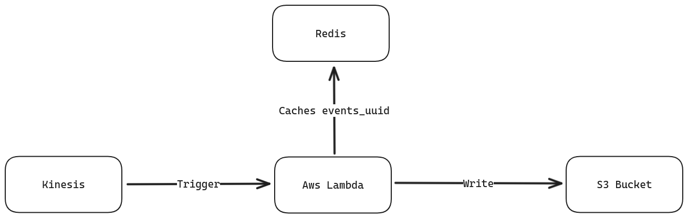

# Babbel Home Test

### Architecture

### Components
- **Kinesis data stream**. Store events data
- **Aws Lambda function**. The main function that preprocess the data. It is invoked if either the batch size specified is reached, or after a timeout value
- **Redis**. Used for dealing with duplicated events. It stores the uuid of the events
- **S3 bucket**. Bucket where preprocessed data are stored. 

### Flow
The lambda function is triggered after the batch size defined is reached or after a maximum time that is also defined in the configuration.
The lambda function simply reads the data from the event, and preprocess them. For the preprocessing, duckdb is used for the following reasons:
- simplicity of use thanks to the sql interface
- faster than other libraries like pandas
- allows larger than memory dataset to be processed

The data are partitioned by date and event type. Indeed, an additional column date is computed, this column is used for partitioning.
Data are stored in parquet format

## Design questions

### How would you handle the duplicate events? What quality metrics would you define for the input data?

For handling the duplicate events, I choose to add a redis component that stores in cache the *event_uuid* of the events received in the last 7 days.
The SQL query that handles the data transformation discards the duplicated events. 

This assumes that each event has a unique ID, meaning that a duplicate event is an event sent twice by kinesis data stream.
The choice of setting the cache expiration to 7 days is due to this fact

Regarding the quality metrics, I would define the following:
- data accuracy
- The number of events containing missing values
- Number of duplicate events
- Data freshness

### How would you partition the data to ensure good performance and scalability? Would your proposed solution still be the same if the amount of events is 1000 times smaller or bigger?
I choose to partition the data by date and event type. 
In this way we can ensure scalability, even though there could be a problem if the number of received events is small. In that case, we would have many small files that are not the best for performance and also cost.
This solution ensures scalability, since even if the data are growing, we have a structured way to store efficiently the data

### What format would you use to store the data?
In this case I thought of two solutions:
- storing the data as json
- saving the data to a binary format, specifically parquet.

I decided for using parquet for the following reasons:
- reads are faster
- requires less disk space

Obviously the con to this solution is that the data stored in this format are not human readable, but it shouldn't be a problem.

## Notes

Regarding the code, I'm not familiar with both AWS and Terraform, so I'm not sure the terraform file works.
In the code I didn't implement the metric collection. I decided to just compute the number of duplicate events and return them in the response. A better solution would be to deploy a component like prometheus and collect the metrics defined above.